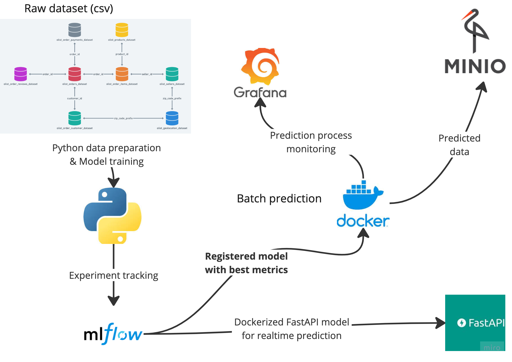
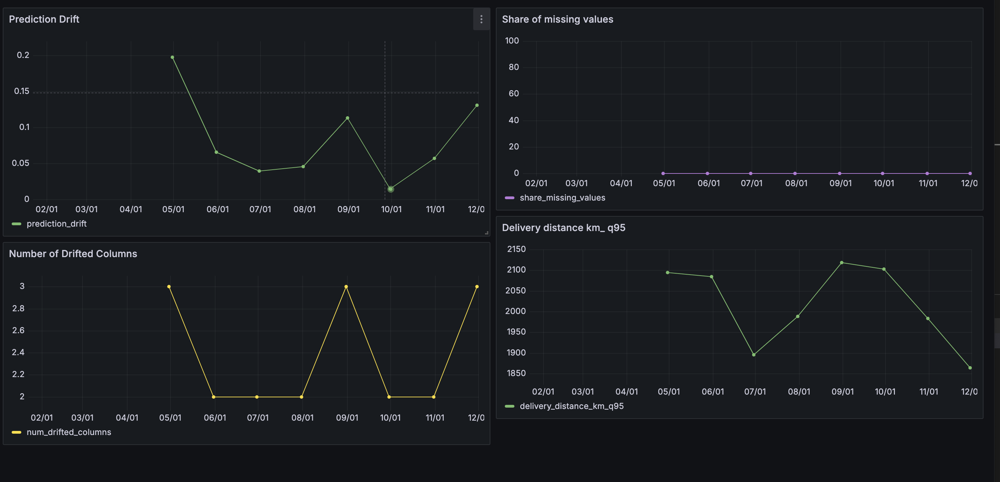
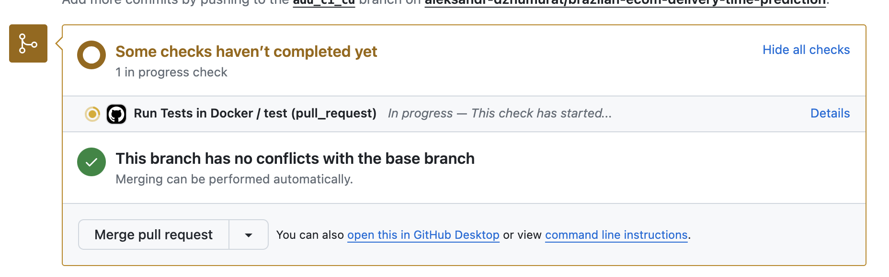
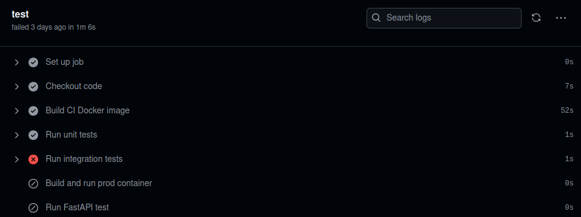
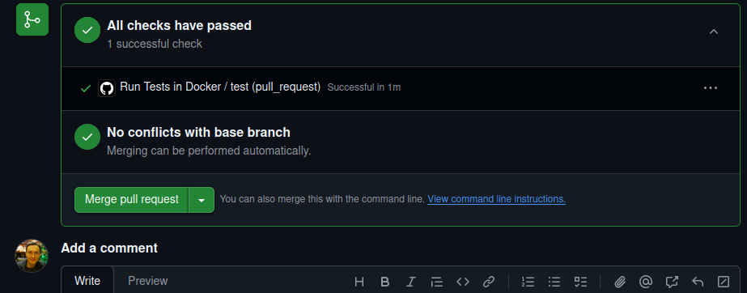

# Ecom delivery time predictiob

##  Problem description

This project focuses on developing and deploying a delivery time prediction model using e-commerce data.

The aim is to *predict the delivery time* for orders based on various factors

* customer ZIP-code
* seller XIP-code
* delivery distance

We are implement
* batch prediction (3-6k orders per month)
* realtime FastAPI prediction service


Model enhances the efficiency of logistics and improving customer satisfaction.

Objectives
* Develop data preparation pipeline
* Develop a machine learning model to predict delivery times for e-commerce orders.
* Implement MLOps practices to automate the deployment, monitoring, and management of the model.
* Dockerize model using FastAPI service

## Project details

### Cloud

Used techmologies
* Localstack (S3) for storing batch predictions
* MinIO and MLFlow for model tracking
* Grafana for model monitoring
* Dockerized FastAPI to deploy model in Cloud (terraform is not used)



Infrastructure described in [docker-compose.yml](./docker-compose.yml)

### Reproducibility

#### Data preparation pipeline

First, prepare directory structure for data. Command will create `data_store` directory and all subdirectories.

```shell
make prepare-dirs
```

Download `.zip` archive from the [kaggle competition](https://www.kaggle.com/datasets/olistbr/brazilian-ecommerce) and put the archive to the directory `data_store/dataset`. 

Build and run docker image for local development
```shell
make run-dev
```

Run data extraction script to
* unpack .zip 
* prepare train and valid data

```shell
make prepare-data
```

After params search and registering the model (see sections below) your will get dockerized FastAPI model ready to deploy.

### Workflow orchestration

Basic workflow orchestration
* config stored in [config.yml](./src/config.yml)
* batch model training orcestrated with congig-parametrized script [batch_prediction_backfill.py](./src/batch_prediction_backfill.py)


### Experiment tracking & model registry

Set up MLFlow 

Postgres

```shell
make run-postgres
```

Terminate  Postgres, run MLFlow
```shell
make run-mlflow
```

Terminate ML flow, run Jupyter
```shell
make run-jupyter
```

Open [EDA](./src/notebooks/EDA.ipynb) and view charts and dasboards

Run params search. After script finished check [MLFlow](http://localhost:8000/)

```shell
make run params-search
```

We will auromatically change best model params (== with lowest RMSE)


Train and register best model
```shell
 make register-model
```

Ready! Model trained and registered with MLFlow

### Model deployment

Model Dockerized and ready to deploy in Cloud

Build production image and push to Docker registry [adzhumurat/delivery_time_prediction](https://hub.docker.com/repository/docker/adzhumurat/delivery_time_prediction/general)
```shell
make prepare-prod
```

Run FastAPI locally in Docker
```shell
make run-prod
```

Test from curl
```shell
curl -X POST http://127.0.0.1:8090/delivery_time \
    -H "Content-Type: application/json" \
    -d '{"seller_zip_code_prefix":12345, "customer_zip_code_prefix":54321, "delivery_distance_km":50}'
```

Result: delivery time predicted in JSON format!
```json
{"seller_zip_code_prefix":12345,"customer_zip_code_prefix":54321,"delivery_distance_km":50,"delivery_time":60.0}
```


# Model monitoring

Grafana is used for model monitoring. We use [batch_prediction_backfill.py](./src/batch_prediction_backfill.py) script that calculates and reports metrics

Backfill data and check dashboards in [grafana](http://localhost:3000/)

```shell
make backfill
```

We are able to monitor
* 95% quantile for delivery time
* num drifted columns
* share of most frequent value



## Best practices

### Tests

[tests](./src/tests) - unitests (will use that for for ci/cd below)

```shell
make tests
```

[integration_tests](./src/integration_tests) - for integration tests 

```shell
make integration-tests
```

### Code quality 

Linters runs `autopep8 --in-place --aggressive --aggressive --recursive .`
```shell
make lint
```

### Pre-commit hooks

every commit has to be checked with `.git/hooks/commit-msg`

```shell
start_check=$(head -1 $1 | grep -qiE "^(Feature|Fix):")
if [ $? -ne 0 ]; then
    echo "Commit message should start with 'Feature:' or 'Fix:'." 1>&2
    exit 1
fi
```

Example
```shell
git commit -m 'Add code linters'
```

Result
```
Commit message must contain 'Feature' or 'Fix'.
```

Correct version: `git commit -m 'Feature: code linters' `

### Makefile

[Makefile](./Makefile) used for an automation

### CI/CD pipeline

For every merge requests we run tests



If smth is wrong with your code test will be failed



Otherwise you can merge




# Dagster

DO NOT IMPLEMENTED - for future improvements

https://www.skytowner.com/explore/getting_started_with_dagster

```shell
pyenv install 3.10 && \
pyenv virtualenv 3.10 delivery-prediction-env && \
source ~/.pyenv/versions/delivery-prediction-env/bin/activate && \
pip install --upgrade pip && \
pip install -r dagster_requirements.txt
```

Materialization
http://localhost:3000/assets

