# Delivery Time Prediction - End-to-End MLOps (local S3: MinIO + LocalStack, cloud-ready)
[](https://deepwiki.com/alex-sokolov2011/delivery-time-prediction-mlops)
[](https://opensource.org/licenses/MIT)


---

## With this project
Spin up a **laptop-only, cloud-ready** MLOps stack in minutes and learn by doing. You’ll prepare data, train a CatBoost model, **track runs in MLflow**, store artifacts in **MinIO (S3)**, **serve** predictions via FastAPI, and **visualize** health in Grafana. The workflow is **Dockerized**, **uv-powered** (fast, deterministic installs), and **Makefile-driven** so every step is reproducible and easy to tweak. Treat it as a small but realistic scaffold you can fork, extend, and ship.
> Storage backends: MLflow artifacts → **MinIO** (S3-compatible). Batch/backfill exercises → **LocalStack S3**. Two endpoints and two credential sets by design to practice both paths and mimic cloud migration.


### Who is this for
- **Beginners learning MLOps locally** - a compact, hands-on template to understand data prep, training, tracking, serving, and monitoring end-to-end
- **Practitioners adapting a small scaffold** - sensible defaults, clean structure, and clear extension points (dataset, features, training, serving, metrics)

## ⚡ Quickstart

### 1) Clone the repo
```bash
git clone https://github.com/alex-sokolov2011/delivery-time-prediction-mlops.git
cd delivery-time-prediction-mlops
```

### 2) Requirements

* **Docker Engine** + **Docker Compose plugin**
* **Git**
* **make** (GNU Make)
* 10-12 GB free disk space

### Install Docker and Docker Compose

Make sure you have [Docker](https://docs.docker.com/get-docker/) and [Docker Compose](https://docs.docker.com/compose/install/) installed on your system.  
On Linux, you may also need to [add your user to the docker group](https://docs.docker.com/engine/install/linux-postinstall/).


### 3) Installation

```bash
# Create local volumes
make prepare-dirs

# Start local stack (MinIO, MLflow, Grafana, Postgres, etc.)
make run-dev

# Download dataset
make download-data

# Prepare data (merge/clean, split train/valid)
make prepare-data

# Train & register model
make register-model

# (Optional) Serve model via FastAPI
make run-prod

# Smoke test the production API container (starts container and hits /delivery_time)
make test-prod

# Generate monitoring metrics for Grafana dashboards (run before opening Grafana)
make backfill

```
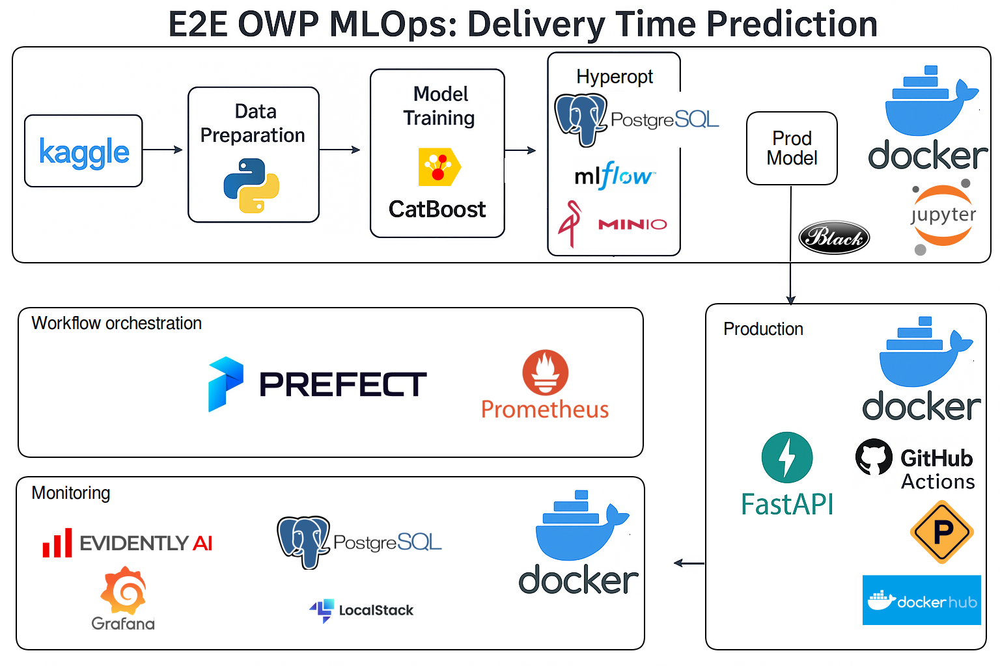

**Open UIs**

* MLflow: [http://localhost:5000](http://localhost:5000)
* MinIO: [http://localhost:9001](http://localhost:9001)
* Grafana: [http://localhost:3000](http://localhost:3000)


> Need the full runbook with explanations and extra commands? See [**Contributing (full runbook in collapsibles)**](#contributing-full-runbook-in-collapsibles) below


## Contributing (full runbook in collapsibles)
<details>
<summary><b>Open to newcomers. Follow this runbook to reproduce, learn, and extend [](https://deepwiki.com/alex-sokolov2011/delivery-time-prediction-mlops)</b></summary>

### Directory Structure
```
.
├── docker-compose.yml             # Local stack: MinIO, MLflow, Grafana, Postgres, services wiring
├── Dockerfile                     # Dev image for local stack (uv-based installs)
├── .env                           # Environment variables (ports, creds) used by docker-compose
├── local-requirements.txt         # Local dev-only tools (linters/formatters), outside images
├── Makefile                       # One-liners: prepare-dirs, run-dev, register-model, run-prod, etc.
├── pyproject.toml                 # Project metadata / tooling config (if applicable)
├── README.md                      # This document
├── requirements.txt               # (Optional) host/dev deps; images use uv + service-level reqs
├── .github
│   └── workflows
│       └── docker-tests.yml       # CI: build ci image, run tests, start API, curl /delivery_time
├── data_store
│   └── prod_model.cbm             # Trained model artifact (mounted/used by prod image)
├── img
│   └── *.png                      # Diagrams & screenshots (MLflow, MinIO, Grafana, etc.)
├── services
│   ├── ci
│   │   └── Dockerfile             # CI image (reuses production requirements)
│   ├── grafana
│   │   ├── config
│   │   │   ├── grafana_dashboards.yaml                  # Dashboards provisioning
│   │   │   └── grafana_datasources.yaml                 # Datasource provisioning (e.g., Postgres)
│   │   └── dashboards
│   │       └── dash_delivery_time_predict_metrics.json  # Prebuilt dashboard
│   ├── jupyter
│   │   ├── base-requirements.txt  # Base libs for notebooks
│   │   ├── Dockerfile             # Jupyter image (uv-based)
│   │   └── requirements.txt       # Jupyter runtime deps
│   ├── minio
│   │   └── Dockerfile             # (If customized) MinIO image tweaks
│   ├── mlflow
│   │   ├── docker-entrypoint.sh   # Bucket bootstrap + mlflow server
│   │   ├── Dockerfile             # MLflow image (uv-based)
│   │   ├── requirements.txt       # MLflow server deps
│   │   └── src
│   │       └── prepare_bucket.py  # Create S3/MinIO bucket for artifacts on startup
│   └── production
│       ├── Dockerfile             # FastAPI serving image (packs prod_model.cbm)
│       └── requirements.txt       # Lean runtime deps for serving
└── src
    ├── batch_prediction_backfill.py  # Generate weekly metrics (Evidently) → Grafana (via DB)
    ├── config.yml                    # Config knobs (paths, params)
    ├── download_dataset.py           # Pull Kaggle dataset via kagglehub
    ├── hyperopt_params_search.py     # Hyperopt tuning, logs to MLflow
    ├── main.py                       # FastAPI app with /delivery_time
    ├── predict_batch.py              # Batch inference pipeline (S3 in/out)
    ├── prefect_deploy_prepare.py     # Prefect deployment (schedule) for data prep
    ├── prefect_prepare_data.py       # Prefect flow for data prep
    ├── prepare_data.py               # Merge/clean/split raw → train/valid
    ├── register_model.py             # Train final CatBoost & register in MLflow
    ├── utils.py                      # Shared helpers (I/O, logging, etc.)
    ├── integration_tests
    │   ├── test_api.py               # Start API from image and assert response
    │   └── test_predict_batch.py     # End-to-end batch path with S3-like storage
    ├── notebooks
    │   └── EDA.ipynb                 # Exploratory analysis (run via make run-jupyter)
    └── tests
        └── test_prepare_data.py      # Unit tests for preprocessing logic
```

### Development Setup (host)

#### Data preparation pipeline

To ensure everything runs the same way across machines, the project includes Makefile targets for setup and reproducibility.

Start by creating the required folder structure:

```bash
make prepare-dirs
```

Then spin up the full development environment to make sure all required services (Postgres, MinIO, MLflow, Grafana, etc.) are up and running:

```bash
make run-dev
```

This will start the local stack defined in docker-compose.yml and ensure all components are available for the subsequent steps.  
Once the containers are running, you can proceed with downloading the dataset using the automated script.

```bash
make download-data
```
This command uses the [`kagglehub`](https://pypi.org/project/kagglehub/) library to fetch the **Brazilian E-Commerce Public Dataset** directly from Kaggle and unpacks it into: `data_store/dataset/`  
No manual `.zip` handling required - the pipeline is fully automated and reproducible

To preprocess the raw data and generate training/validation datasets, run:

```bash
make prepare-data
```
This step handles everything:
- merging and cleaning of raw source tables
- calculating delivery time in days from purchase to delivery
- filtering out outliers 
- saving two datasets: `train_dataset.csv` and `valid_dataset.csv`

You can explore reports and charts in [exploratory data analysis (EDA) notebook](./src/notebooks/EDA.ipynb) by running following command to run jupyter container:
```bash
make run-jupyter
```
```bash
http://localhost:8899
```

> The EDA notebook provides insight into feature distributions, delivery time outliers, correlation analysis, and guides feature selection decisions. The final model uses a smaller, cleaner set of features based on this analysis.


Next, run hyperparameter tuning using `Hyperopt` to find the best CatBoost configuration:

```bash
make params-search
```

This kicks off an MLflow-backed optimization process - typically running 15 trials - and logs metrics like RMSE for each run.

All runs are tracked in the MLflow UI, including parameters, metrics, and artifacts.

You can open [http://localhost:5000](http://localhost:5000) to explore the experiment and see which configuration achieved the lowest RMSE

Once the best set of parameters is selected, you can train the final model and register it:
```bash
make register-model
```
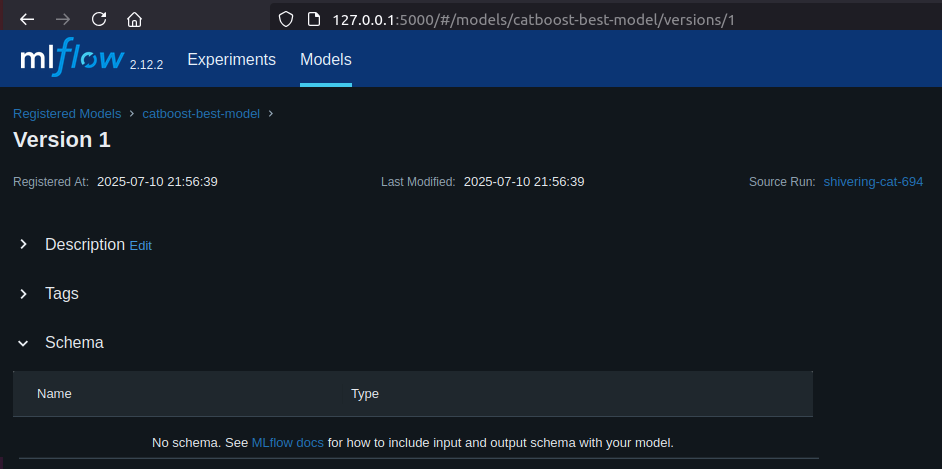

The model artifact is also saved to a local S3-compatible store (MinIO), and visible via the MinIO console:

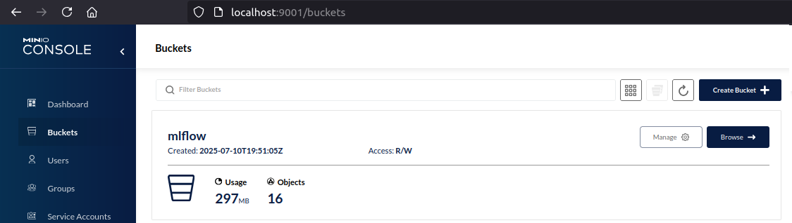

#### Testing

Before moving on to code style checks and deployment, we run unit and integration tests to make sure everything works as expected

##### Unit tests

```bash
make test
```

This executes test_prepare_data in src/tests/, including checks for data preprocessing logic

##### Integration tests

These validate how different parts of the pipeline work together - for example, S3 interactions and batch prediction

```bash
make integration-tests
```

This will:

- create an S3 bucket in LocalStack
- upload a sample batch of input data to the bucket
- run the `predict_batch.py` script inside Docker, using the registered model
- write the predictions back to S3
- load and verify the prediction output, checking structure and numerical results

These tests ensure that:
- the batch pipeline works end-to-end
- MinIO (via LocalStack) correctly simulates S3
- the model can be applied outside of training

#### Code quality & formatting

To ensure clean and consistent code style, we use:

- `isort` - for import sorting
- `black` - for auto-formatting
- `pylint` - for code quality and basic static analysis


Install developer-only requirements (used locally, not in Docker builds):

```bash
make install-local-reqs
```
Then check the formatting and code quality:

```bash
make check
```
If any issues are found, fix them automatically with:
```bash
make format
```
This will reformat files using isort and black:


#### Model deployment

Once the model is trained and registered, we can package it into a production-ready API using FastAPI and Docker

##### Build the production image

Use the following command to build the image from `services/production/Dockerfile`:

```bash
make build-prod
```

This will:

- copy the trained `prod_model.cbm` into the image
- install only runtime dependencies from `requirements.txt`
- include only the necessary code (no dev tools, no training scripts)
- expose a FastAPI app that serves predictions on port `8090`

> You can also tag and push this image to your own Docker registry, if needed

##### Run FastAPI locally in Docker
```bash
make run-prod
```

##### Run production test locally

Before pushing the image to a Docker registry, it's good practice to **validate the production build end-to-end**

We include a dedicated test that:

- starts the FastAPI app from the Dockerized image
- sends a real request to `http://127.0.0.1:8090/delivery_time`
- checks response code and payload structure

```bash
make test-prod
```
This ensures the containerized model is healthy and serving real predictions - exactly as it will in production


##### Push the image to Docker Hub

Once you've verified the production image works locally, you can push it to Docker Hub (or any other registry).

Make sure you're logged in:

```bash
docker login
```
Then run:
```bash
make prepare-prod
```
> The image name and tag are configured via environment variables in your Makefile

After the push completes, your FastAPI model will be available remotely and ready for deployment

#### Model monitoring

To monitor prediction quality over time, we use **Grafana dashboards fed by Evidently reports**.  
These reports are generated weekly using a script that simulates real production usage.

```bash
make backfill
```

This executes the `batch_prediction_backfill.py` script, which:

- loads the registered model from disk
- generates predictions week by week over historical data
- calculates statistical and drift metrics using Evidently
- inserts these metrics into a dedicated Postgres table (`model_metrics`)

You can then open [Grafana](http://localhost:3000) to view dashboards based on these metrics.

The dashboards are automatically provisioned and include time-series visualizations for:

- `share_missing_values` - percentage of missing values in input data
- `prediction_drift` - statistical drift in model output
- `num_drifted_columns` - number of input columns with drift
- `value_range_share_in_range` - share of predictions falling in the expected value range
- `prediction_corr_with_features` - correlation of predictions with input features

This gives you visibility into how model performance and data quality evolve over time - a core part of real-world MLOps.

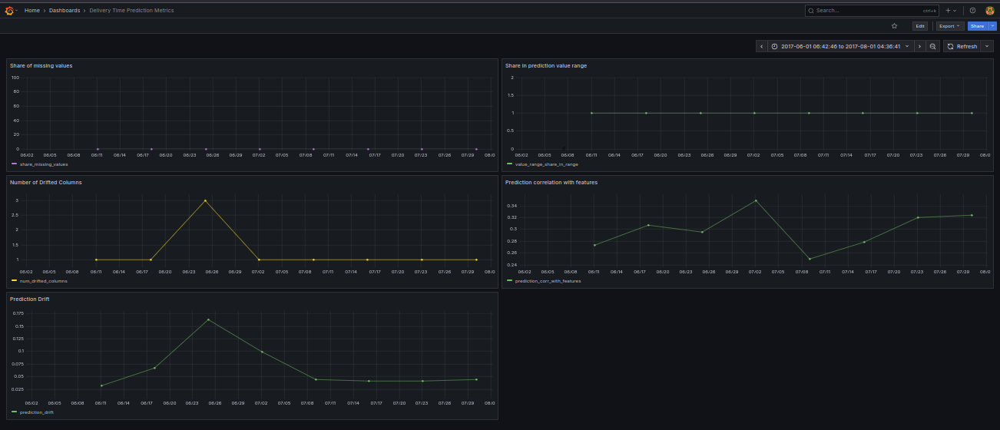

We also integrate **Prometheus + Grafana** for real-time API monitoring.  
Prometheus scrapes metrics from FastAPI (`/metrics` endpoint), and Grafana dashboards visualize:
- request rate, latency, error codes
- custom model metrics (prediction counts, delivery time distribution)

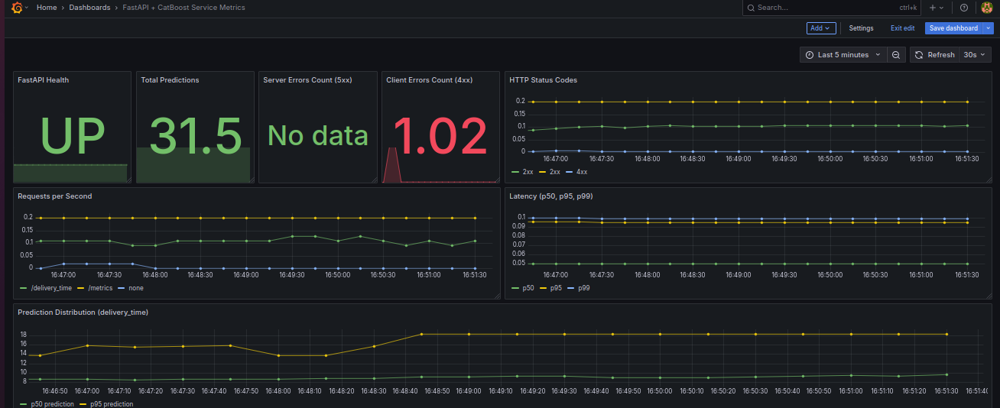
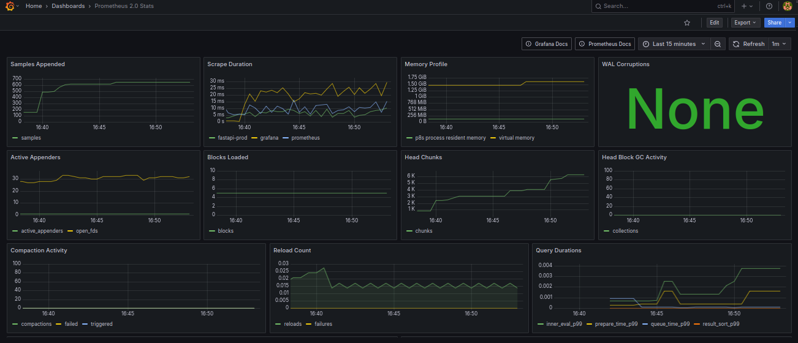
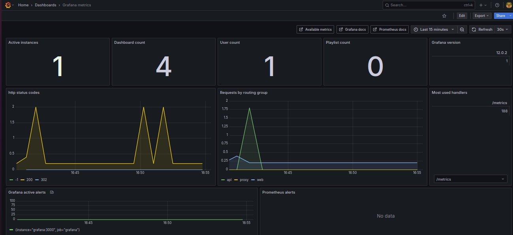


#### Pre-commit message hook

To enforce commit message conventions across the team (or just for yourself), we include a local Git hook that checks message prefixes.

Install the hook with:

```bash
make setup-commit-hook
```
This adds a commit-msg hook that allows only messages starting with:
`Feature:, Fix:, Refactor:, Docs:, Test:, Chore:, Style:, Perf:, Revert:, WIP`

##### Example usage

Try a bad commit (should fail):
```bash
make test-bad-commit
```

Try a good commit:
```bash
make test-good-commit
```
> Helps enforce meaningful commit history and team-wide consistency

#### Makefile automation

The entire workflow is streamlined via a clean and readable [Makefile](./Makefile),  
which lets you run all the key project tasks with simple commands.

You can also list all available targets with:

```bash
make help
```
This will print a list of documented commands with short descriptions - helpful for onboarding or revisiting the project later.

#### CI/CD pipeline

A GitHub Actions workflow is included to automate testing and validation on every push and pull request to the `main` branch.

It runs the following steps:

1. **Builds a fresh Docker image** (`ci:latest`) using only production code and dependencies
2. **Runs unit tests** (e.g. data prep validation)
3. **Starts the FastAPI service** from the built image
4. **Sends a real POST request** to `/delivery_time` with sample payload
5. **Checks the response** structure and status code
6. **Fails the pipeline** if the response is incorrect or the service doesn't start

All of this is configured in [`docker-tests.yml`](./.github/workflows/docker-tests.yml).

Examples from real CI runs:

- ✅ All checks passed

  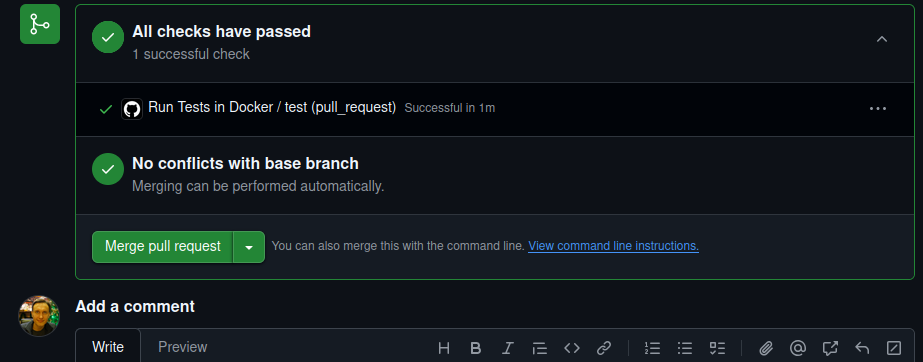

- ❌ Test failure blocks the merge

  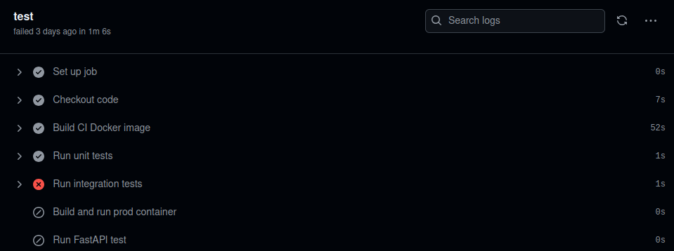

> This ensures your production image always works - no surprises after `docker push`

> ⚠️ Note: For reproducibility, this repository includes a ready-to-use `.env` file with prefilled keys.  
> In production projects it’s better practice to provide only a `.env.example` and keep real credentials out of version control.

#### Prefect orchestration

We use **Prefect 3** to orchestrate the data preparation pipeline and demonstrate scheduled automation in a production-like setting.

##### Run once (ad-hoc execution)

You can trigger the pipeline manually by executing:

```bash
make run-prefect-prepare
```

This runs the flow defined in [`prefect_prepare_data.py`](src/prefect_prepare_data.py) and:

- merges raw tables
- calculates delivery time
- splits into train/validation
- saves outputs into `data_store/prefect/`

The Prefect UI will show a new run and detailed logs.

##### Run with Prefect server and scheduler

To launch full orchestration with scheduling and workers:

```bash
make run-prefect
```

Then, in another terminal, register and start a worker:

```bash
make prefect-all
```

You should now be able to open [http://localhost:4200](http://localhost:4200) to access the **Prefect UI**, where:

- the flow **Prepare Data** is deployed
- it is scheduled to run every 5 minutes
- completed runs are visualized on the dashboard

To deploy the flow with a schedule:

```bash
make run-prefect-deploy
```

This uses [`prefect_deploy_prepare.py`](src/prefect_deploy_prepare.py) to register the flow and attach a schedule.

> The deployment is set to run every 5 minutes by default. You can modify the cron schedule in the deploy script.

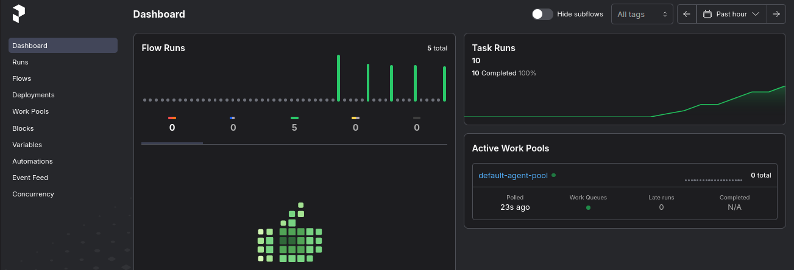

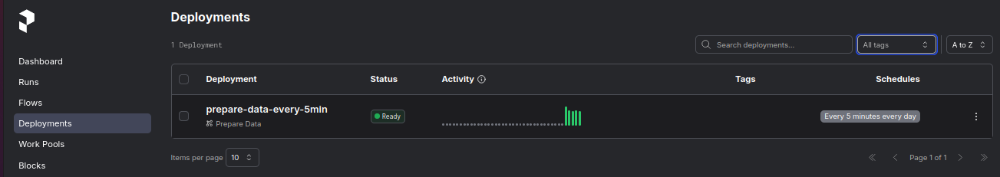

### Current TODO list
In no particular order, here is the non-exhaustive list of known wanted features :
- [ ] Prefect-based orchestration full pipeline with Prometheus
- [x] Prometheus monitoring (basic integration done)
 

### Rules
- Commit messages must start with one of:
  `Feature:, Fix:, Refactor:, Docs:, Test:, Chore:, Style:, Perf:, Revert:, WIP:`
- Install the local commit-msg hook:
  ```bash
    make setup-commit-hook
  ```
- Do not add heavy dependencies without a reason. Prefer small, standard tools.
- Keep configs in `src/config.yml`, avoid hardcoded paths in code.

### Coding hints

- Change features & cleaning in `src/prepare_data.py`
- Switch/tune model in `hyperopt_params_search.py` and `register_model.py`
- Serving logic lives in `src/main.py` (FastAPI).
- Batch & monitoring metrics: `batch_prediction_backfill.py`
- Track experiments and artifacts with MLflow (UI at :5000)
- Use deterministic installs in images via **uv** (already configured in Dockerfiles)

</details>

## Project legend
This project started as a practical answer to a real request from a friend running an e-commerce shop: _“Can we predict delivery ETAs reliably without a full DS/MLOps team?”_  
The result is a **laptop-only, cloud-ready** scaffold with local S3 (MinIO), MLflow, FastAPI, and Grafana. You can start simple, collect data, and gradually evolve the stack as the team grows (analyst → DS → MLE), without throwing work away.  
The project was originally implemented as the final capstone project of the [MLOps Zoomcamp](https://datatalks.club/) by DataTalks.Club, the repo is now maintained as a **lightweight template** for newcomers and practitioners who want a clean, reproducible end-to-end setup.


## Questions?
- Open an **Issue** in this repo with a short description and steps to reproduce
- For general questions or networking, see contact links in my **[overview profile](https://github.com/alex-sokolov2011)** 

## License
This project is released under the **MIT License**.  
See [LICENSE](./LICENSE) for details.

