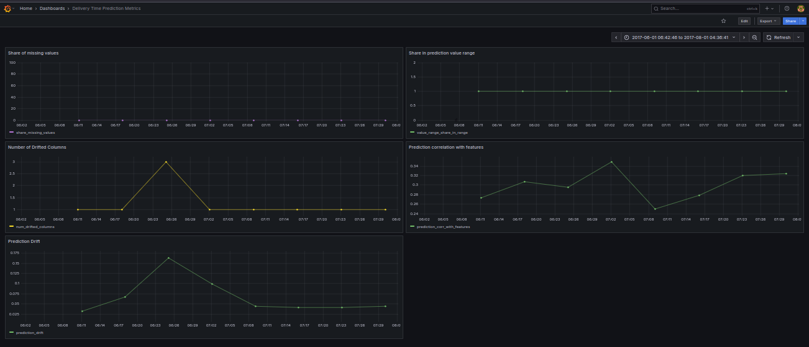

# E2E OWP MLOps project: delivery time prediction


##  Problem description

This one-week project tackles a common pain point in e-commerce: **unreliable delivery time estimates**.  
We set out to build an end-to-end pipeline that predicts delivery time (in days) from order to delivery, based on:

- seller ZIP code prefix  
- customer latitude and longitude

The solution includes:
- batch predictions
- Real-time API - FastAPI-powered prediction endpoint

The goal was not just to build a model, but to **deliver a reproducible, testable and portable MLOps setup** - something a real-world team could extend or productionize further

### Project Objectives
- Build a clear, modular **data preparation pipeline**
- Train and evaluate a **CatBoost regression model** for delivery time
- Implement core **MLOps tooling**: tracking, packaging, testing, monitoring
- Run everything locally using **Docker**, **MLflow**, **MinIO**, **Grafana**, and **FastAPI**

## Project details

This project is designed to be **fully local and cloud-ready** - without depending on any external managed services.

Here’s a breakdown of the tech stack:

- **LocalStack (S3-compatible)** - simulates AWS S3 for storing batch prediction results
- **MinIO + MLflow** - used for model artifact storage and experiment tracking
- **Grafana** - tracks data and model quality metrics (e.g. drift, delivery time quantiles)
- **FastAPI in Docker** - serves the trained model as a RESTful prediction endpoint  

> All services are containerized and orchestrated via `docker-compose`


## Reproducibility

### Data preparation pipeline

To ensure everything runs the same way across machines, the project includes Makefile targets for setup and reproducibility.

Start by creating the required folder structure:

```bash
make prepare-dirs
```
Then, download the dataset using the automated script:

```bash
make download-data
```
This command uses the [`kagglehub`](https://pypi.org/project/kagglehub/) library to fetch the **Brazilian E-Commerce Public Dataset** directly from Kaggle and unpacks it into: `data_store/dataset/`  
No manual `.zip` handling required - the pipeline is fully automated and reproducible

To preprocess the raw data and generate training/validation datasets, run:

```bash
make prepare-data
```
This step handles everything:
- merging and cleaning of raw source tables
- calculating delivery time in days from purchase to delivery
- filtering out outliers 
- saving two datasets: `train_dataset.csv` and `valid_dataset.csv`

You can explore reports and charts in [exploratory data analysis (EDA) notebook](./src/notebooks/EDA.ipynb) by running following command to run jupyter container:
```bash
make run-jupyter
```
```bash
http://localhost:8899
```

> The EDA notebook provides insight into feature distributions, delivery time outliers, correlation analysis, and guides feature selection decisions. The final model uses a smaller, cleaner set of features based on this analysis.


Next, run hyperparameter tuning using `Hyperopt` to find the best CatBoost configuration:

```bash
make params-search
```

This kicks off an MLflow-backed optimization process - typically running 15 trials - and logs metrics like RMSE for each run.

All runs are tracked in the MLflow UI, including parameters, metrics, and artifacts.

You can open [http://localhost:5000](http://localhost:5000) to explore the experiment and see which configuration achieved the lowest RMSE

Once the best set of parameters is selected, you can train the final model and register it:
```bash
make register-model
```


The model artifact is also saved to a local S3-compatible store (MinIO), and visible via the MinIO console:


### Testing

Before moving on to code style checks and deployment, we run unit and integration tests to make sure everything works as expected

#### Unit tests

```bash
make tests
```

This executes test test_prepare_data in src/tests/, including checks for data preprocessing logic

#### Integration tests

These validate how different parts of the pipeline work together - for example, S3 interactions and batch prediction

```bash
make integration-tests
```

This will:

- create an S3 bucket in LocalStack
- upload a sample batch of input data to the bucket
- run the `predict_batch.py` script inside Docker, using the registered model
- write the predictions back to S3
- load and verify the prediction output, checking structure and numerical results

These tests ensure that:
- the batch pipeline works end-to-end
- MinIO (via LocalStack) correctly simulates S3
- the model can be applied outside of training

### Code quality & formatting

To ensure clean and consistent code style, we use:

- `isort` - for import sorting
- `black` - for auto-formatting
- `pylint` - for code quality and basic static analysis

---

Install developer-only requirements (used locally, not in Docker builds):

```bash
make install-local-reqs
```
Then check the formatting and code quality:

```bash
make check
```
If any issues are found, fix them automatically with:
```bash
make format
```
This will reformat files using isort and black:


### Model deployment

Once the model is trained and registered, we can package it into a production-ready API using FastAPI and Docker

#### Build the production image

Use the following command to build the image from `services/production/Dockerfile`:

```bash
make build-prod
```

This will:

- copy the trained `prod_model.cbm` into the image
- install only runtime dependencies from `requirements.txt`
- include only the necessary code (no dev tools, no training scripts)
- expose a FastAPI app that serves predictions on port `8090`

> You can also tag and push this image to your own Docker registry, if needed

#### Run FastAPI locally in Docker
```bash
make run-prod
```

#### Run production test locally

Before pushing the image to a Docker registry, it's good practice to **validate the production build end-to-end**

We include a dedicated test that:

- starts the FastAPI app from the Dockerized image
- sends a real request to `http://127.0.0.1:8090/delivery_time`
- checks response code and payload structure

```bash
make test-prod
```
This ensures the containerized model is healthy and serving real predictions - exactly as it will in production


#### Push the image to Docker Hub

Once you've verified the production image works locally, you can push it to Docker Hub (or any other registry).

Make sure you're logged in:

```bash
docker login
```
Then run:
```bash
make prepare-prod
```
> The image name and tag are configured via environment variables in your Makefile

After the push completes, your FastAPI model will be available remotely and ready for deployment

### Model monitoring

To monitor prediction quality over time, we use **Grafana dashboards fed by Evidently reports**.  
These reports are generated weekly using a script that simulates real production usage.

```bash
make backfill
```

This executes the `batch_prediction_backfill.py` script, which:

- loads the registered model from disk
- generates predictions week by week over historical data
- calculates statistical and drift metrics using Evidently
- inserts these metrics into a dedicated Postgres table (`model_metrics`)

You can then open [Grafana](http://localhost:3000) to view dashboards based on these metrics.

The dashboards are automatically provisioned and include time-series visualizations for:

- `share_missing_values` - percentage of missing values in input data
- `prediction_drift` - statistical drift in model output
- `num_drifted_columns` - number of input columns with drift
- `value_range_share_in_range` - share of predictions falling in the expected value range
- `prediction_corr_with_features` - correlation of predictions with input features

This gives you visibility into how model performance and data quality evolve over time - a core part of real-world MLOps.



### Pre-commit message hook

To enforce commit message conventions across the team (or just for yourself), we include a local Git hook that checks message prefixes.

Install the hook with:

```bash
make setup-commit-hook
```
This adds a commit-msg hook that allows only messages starting with:
`Feature:, Fix:, Refactor:, Docs:, Test:, Chore:, Style:, Perf:, Revert:, WIP`

#### Example usage

Try a bad commit (should fail):
```bash
make test-bad-commit
```

Try a good commit:
```bash
make test-good-commit
```
> Helps enforce meaningful commit history and team-wide consistency

### Makefile automation

The entire workflow is streamlined via a clean and readable [Makefile](./Makefile),  
which lets you run all the key project tasks with simple commands.

You can also list all available targets with:

```bash
make help
```
This will print a list of documented commands with short descriptions - helpful for onboarding or revisiting the project later.

### CI/CD pipeline

A GitHub Actions workflow is included to automate testing and validation on every push and pull request to the `main` branch.

It runs the following steps:

1. **Builds a fresh Docker image** (`ci:latest`) using only production code and dependencies
2. **Runs unit tests** (e.g. data prep validation)
3. **Starts the FastAPI service** from the built image
4. **Sends a real POST request** to `/delivery_time` with sample payload
5. **Checks the response** structure and status code
6. **Fails the pipeline** if the response is incorrect or the service doesn't start

All of this is configured in [`docker-tests.yml`](./.github/workflows/docker-tests.yml).

Examples from real CI runs:

- ✅ All checks passed

  

- ❌ Test failure blocks the merge

  

> This ensures your production image always works - no surprises after `docker push`

## Future improvements

- Prefect-based orchestration pipeline (not implemented)

## Evaluation Checklist

| Criteria                                      | Score     | Notes                                                                 |
|----------------------------------------------|-----------|-----------------------------------------------------------------------|
| **Problem description**                      |  2/2     | Clearly described and well-scoped at the top of the README            |
| **Cloud / LocalStack usage**                 |  2/4     | LocalStack + MinIO used for S3-compatible storage and emulation       |
| **Experiment tracking & model registry**     |  4/4     | MLflow used for both tracking and model registration                  |
| **Workflow orchestration**                   |  0/4     | Not implemented                     |
| **Model deployment**                         |  4/4     | Dockerized FastAPI service, tested and ready for deployment           |
| **Model monitoring**                         |  2/4     | Batch monitoring via Evidently + Grafana; no alerting or automation   |
| **Reproducibility**                          |  4/4     | Fully reproducible with Makefile, dataset automation, dependency locking |

### Best practices checklist (6/6)

- [x] Unit tests
- [x] Integration tests
- [x] Linter and/or code formatter
- [x] Makefile
- [x] Pre-commit hooks
- [x] CI/CD pipeline

>  **Total score: 24 / 32**